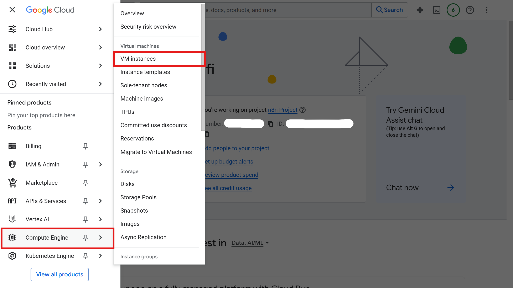
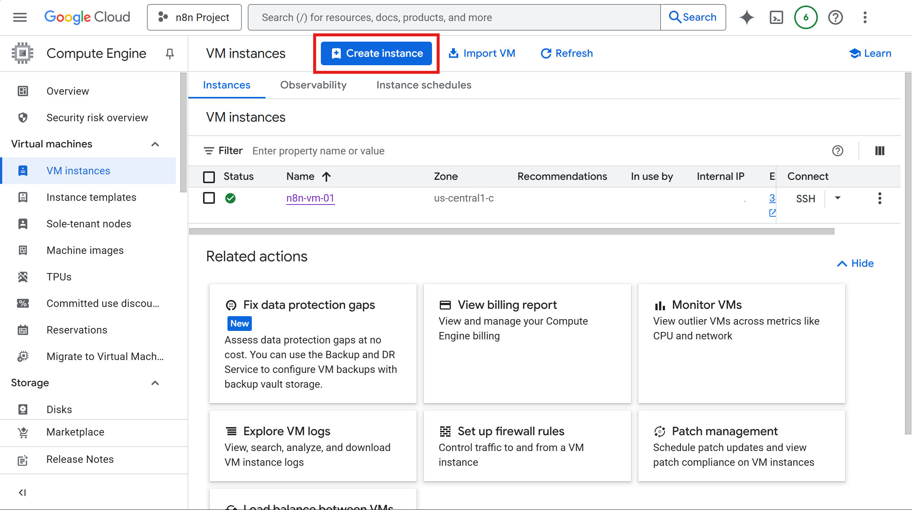
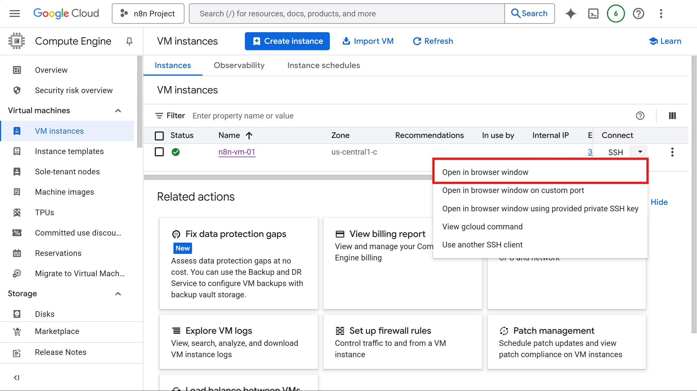

# Setup Guide for n8n Workflow Automation on Google Cloud VM

This repository provides a complete step-by-step guide to install and run **n8n**, a workflow automation tool, on a **Google Cloud VM** using Docker, Docker Compose, and Traefik for reverse proxy and SSL.

---

## 🚀 Project Overview
- Host **n8n** on a cloud VM for workflow automation  
- Use **Docker** & **Docker Compose** for container management  
- Use **Traefik** for reverse proxy & TLS/SSL  
- Fully configurable via `.env` files  

---

## 🛠️ Prerequisites
- Google Cloud account
- A custom domain/subdomain (_you can get for FREE from www.noip.com_)

---

## ⚡ Step-by-Step Setup

### 1. Create Google Cloud VM (Free)

Firstly, create a new project. Then, inside your new project, go to **Compute Engine > VM instances** to create your VM instance.



Create your VM by clicking **Create Instance** with blue button on the top.



Use this below configurations to get VM for **FREE**. Noted that using free configuration might underperform your performance especially if you want to make a big scale project. For testing or lightweight project, might not be a problem.

#### Machine Configuration:
- Region: _us-west1 (Oregon)_ or _us-central1 (Iowa)_ or _us-east1 (South Carolina)_
- Zone: _Any_
- Machine type: _e2-micro (2 vCPU, 1 core, 1 GB memory)_

#### OS and Storage:
- OS: _Ubuntu_
- Version: _Ubuntu 25.04 Minimal_
- Boot disk type: _Standard persistent disk_
- Size (GB): _30_

#### Networking:
- ☑ Allow HTTP Traffic
- ☑ Allow HTTPS Traffic
- ☑ Allow Load Balancer Health Checks
- Network tags: _n8n_
- Hostname: _Any your domain link_

Create and you're done with your VM instance!🤗

---

### 2. Launch the VM by connecting to the SSH

Click the down arrow next to the **SSH** button. Choose **Open in browser** window and it will open a terminal window through your browser, giving you direct access to your server.



---

### 3. Initialize Ubuntu

```bash
# Update package list and upgrade installed packages
sudo apt-get update
sudo apt-get upgrade

# Install prerequisite packages
sudo apt-get install -y ca-certificates curl
sudo apt install -y nano
```

---

### 4. Install Docker & Docker Compose

```bash
# Download Docker signing key
sudo install -m 0755 -d /etc/apt/keyrings
sudo curl -fsSL https://download.docker.com/linux/ubuntu/gpg -o /etc/apt/keyrings/docker.asc
sudo chmod a+r /etc/apt/keyrings/docker.asc

# Add Docker repository
echo "deb [arch=$(dpkg --print-architecture) signed-by=/etc/apt/keyrings/docker.asc] https://download.docker.com/linux/ubuntu $(. /etc/os-release && echo "${UBUNTU_CODENAME:-$VERSION_CODENAME}") stable" | sudo tee /etc/apt/sources.list.d/docker.list > /dev/null

# Update and install Docker
sudo apt-get update
sudo apt-get upgrade
sudo apt-get install -y docker-ce docker-ce-cli containerd.io docker-buildx-plugin docker-compose-plugin
```

---

### 5. Verify Installation

```bash
docker --version
docker compose version
```

---

### 6. Upload Project Folder from GitHub

```bash
# Example: clone your repo
git clone https://github.com/<USERNAME>/n8n-google-cloud-deployment.git
cd n8n-google-cloud-deployment
```

---

### 7. Configure Environment Variables

#### n8n folder

Create `.env` file inside `n8n/`:

```bash
# Top level domain and subdomain
DOMAIN_NAME=<<YOUR_CUSTOM_DOMAIN>>
SUBDOMAIN=<<YOUR_CUSTOM_SUBDOMAIN>>

# Timezone
GENERIC_TIMEZONE=Asia/Kuala_Lumpur
```

#### traefik folder

Create `.env` file inside `traefik/`:

```bash
# Email for TLS/SSL certificate
SSL_EMAIL=<<YOUR_OWN_EMAIL>>
```

---

### 8. Launch Docker Containers

#### Launch Traefik

```bash
cd traefik
sudo docker compose up -d
```

#### Launch n8n

```bash
cd ../n8n
sudo docker compose up -d
```

---

### 9. Create n8n Account

- Access n8n via `https://<SUBDOMAIN>.<DOMAIN_NAME>`
- Follow UI to create first account

✅ Done! n8n instance now running on Google Cloud VM with Docker and Traefik.

---

## 🔮 Future Enhancements

- Add workflow backups
- CI/CD pipeline for n8n workflows
- Integrate with other automation tools (WhatsApp, OpenAI, etc.)
